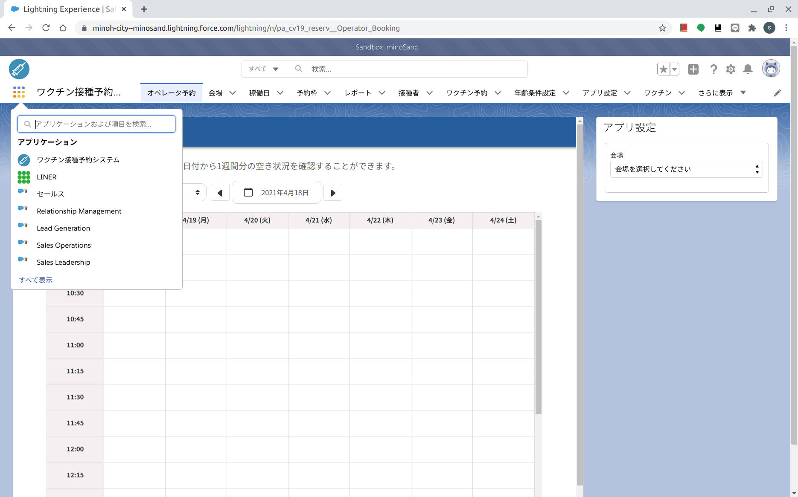

# コールセンター版　１予約受付　[トップへ戻る](https://github.com/78tch/c19v)  
## １予約受付→[２予約変更](https://github.com/78tch/c19v/blob/main/Callcenter_ver/2Callcenter_henkou.md)→[３予約キャンセル](https://github.com/78tch/c19v/blob/main/Callcenter_ver/3Callcenter_cancel.md)  

※コールセンター版  
  

 手順 | 画面  
----|----  
 1.システムにログイン https://test.salesforce.com/ | 画面１    
 ID/PWは別途、本番はまた別のアドレス | 画面１  
 2.「ワクチン接種予約システム→オペレータ予約」を開く。 | 画面２  
 3.「会場、日付」を選ぶ。 | 画面３※「アプリ設定」が邪魔  
 4.「接種券番号」を入力。「姓」に接種券番号、「生年月日」が出るので確認し、「登録」をクリックする。 | 画面４  
 5.「１回目と２回目の接種を同時に予約します。予約された方に２回目の日時を確認し、登録をお願いします。」 | 画面５  
 6.予約が完了したら、「受付番号」が表示されるので、それを伝える。 | 画面６  
 7.すでに予約済の接種券番号を「登録」しようとすると、「既に予約済みです。予約の変更、もしくはキャンセルをお願いします。」と出る。 | 画面７  
 8.タッチの差で予約がいっぱいになって取れなかった場合、「　○○　」と出る。 | 画面８  
 

 画面 | 画面イメージ  
----|----
 画面１ |   
 画面２ |   
 画面３ |   
 画面４ |   
 画面５ |   
 画面６ |   
 画面７ |   
 画面８ |   

 デフォルト文言 | 差し替え案  
----|----
 画面１．ホーム |   
 画面２． |   
 画面３． |   
 画面４． |   
 画面５． |   
 画面６． |   
 画面７． |   

## [トップへ戻る](https://github.com/78tch/c19v)  
## １予約受付→[２予約変更](https://github.com/78tch/c19v/blob/main/Callcenter_ver/2Callcenter_henkou.md)→[３予約キャンセル](https://github.com/78tch/c19v/blob/main/Callcenter_ver/3Callcenter_cancel.md)  
  

