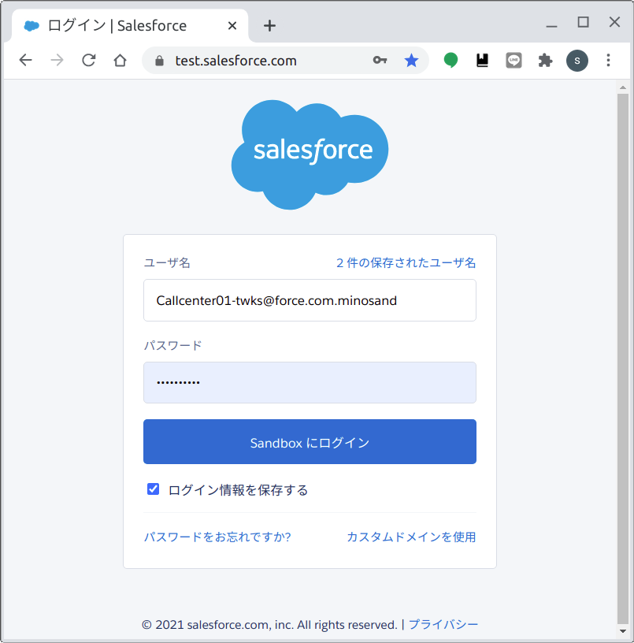
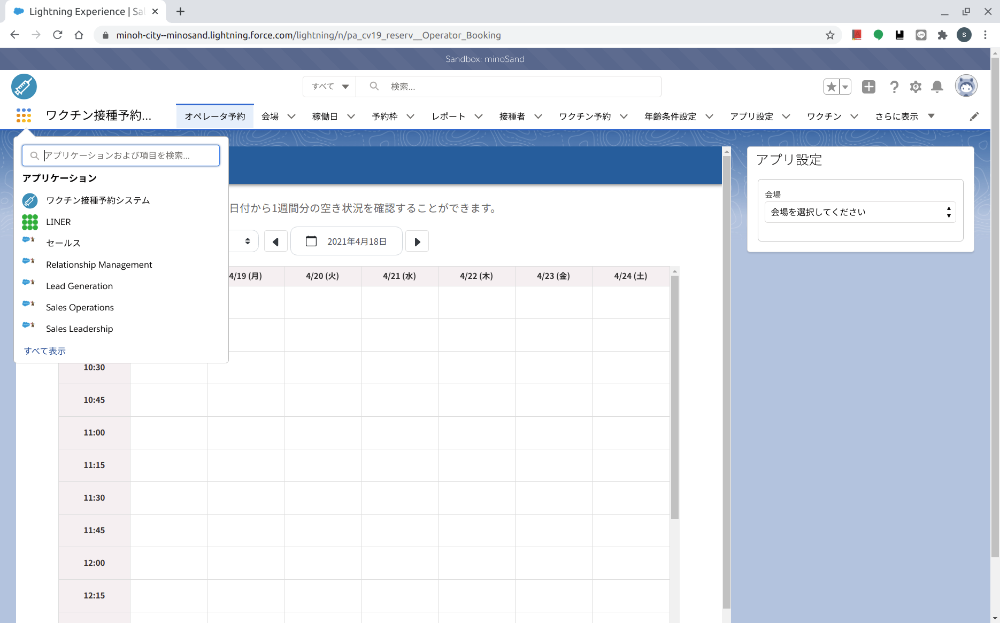
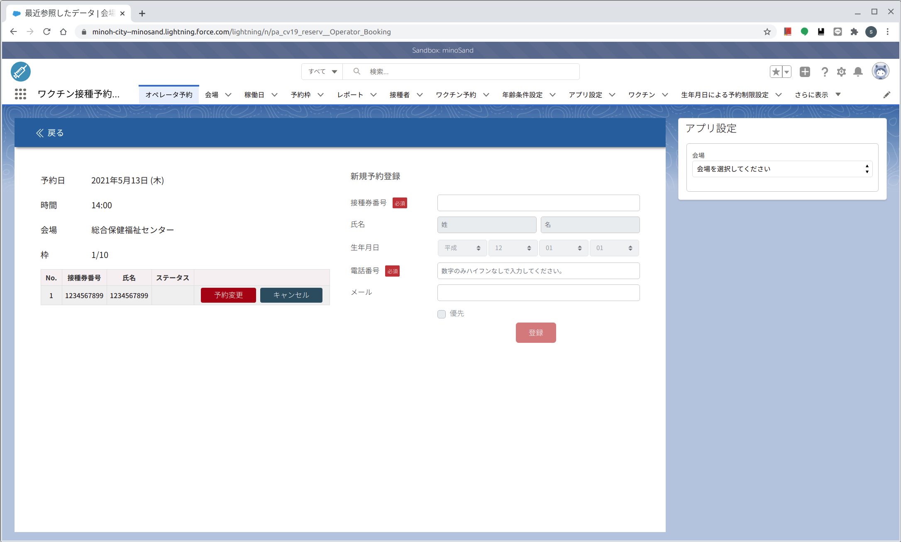
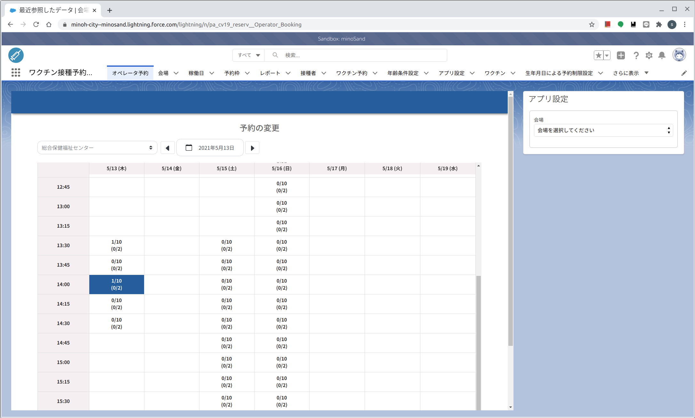
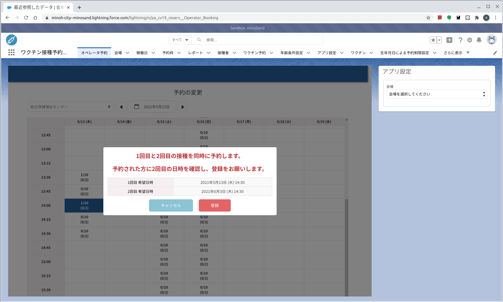

# コールセンター版　３予約変更　[トップへ戻る](https://github.com/78tch/c19v)  
# [１予約受付](https://github.com/78tch/c19v/blob/main/Callcenter_ver/1Callcenter_yoyaku.md)→２予約変更→[３予約キャンセル](https://github.com/78tch/c19v/blob/main/Callcenter_ver/3Callcenter_cancel.md)  

※コールセンター版  
変更・キャンセルしたい予約の「会場・日時」を選んだのち、該当する「接種券番号」を選択して、「変更」または「キャンセル」をクリックする。  
  
 手順 | 画面  
----|----  
 1.システムにログイン https://test.salesforce.com/ | 画面１    
 ID/PWは別途、本番はまた別のアドレス | 画面１  
 2.「ワクチン接種予約システム→オペレータ予約」を開く。 | 画面２  
 3.変更したい予約の「会場、日付」を選ぶ。 | 画面３※「接種券番号」から検索する方法は確認中。  
 4.変更したい「接種券番号」の横の「予約変更」をクリックする。 | 画面４  
 5.元の予約が反転しているので、それ以外の希望の予約枠をクリックする。 | 画面５  
 6.新しい予約の内容を確認し、「登録」をクリックする。 | 画面６  
 7.マ | 画面７  
 

 画面 | 画面イメージ  
----|----
 画面１ |   
 画面２ |   
 画面３ |   
 画面４ |   
 画面５ |   
 画面６ |   
 画面７ |   
 
 デフォルト文言 | 差し替え案  
----|----
 画面１．ホーム |   
 画面２． |   
 画面３． |   
 画面４． |   
 画面５． |   
 画面６． |   
 画面７． |   

# [トップへ戻る](https://github.com/78tch/c19v)  
# [１予約受付](https://github.com/78tch/c19v/blob/main/Callcenter_ver/1Callcenter_yoyaku.md)→２予約変更→[３予約キャンセル](https://github.com/78tch/c19v/blob/main/Callcenter_ver/3Callcenter_cancel.md)  
