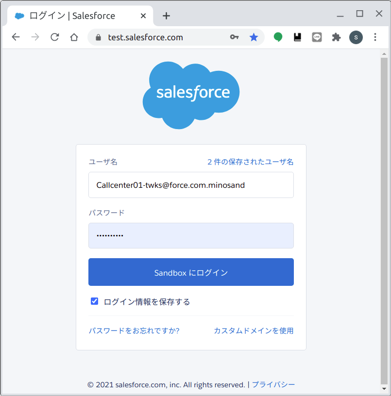
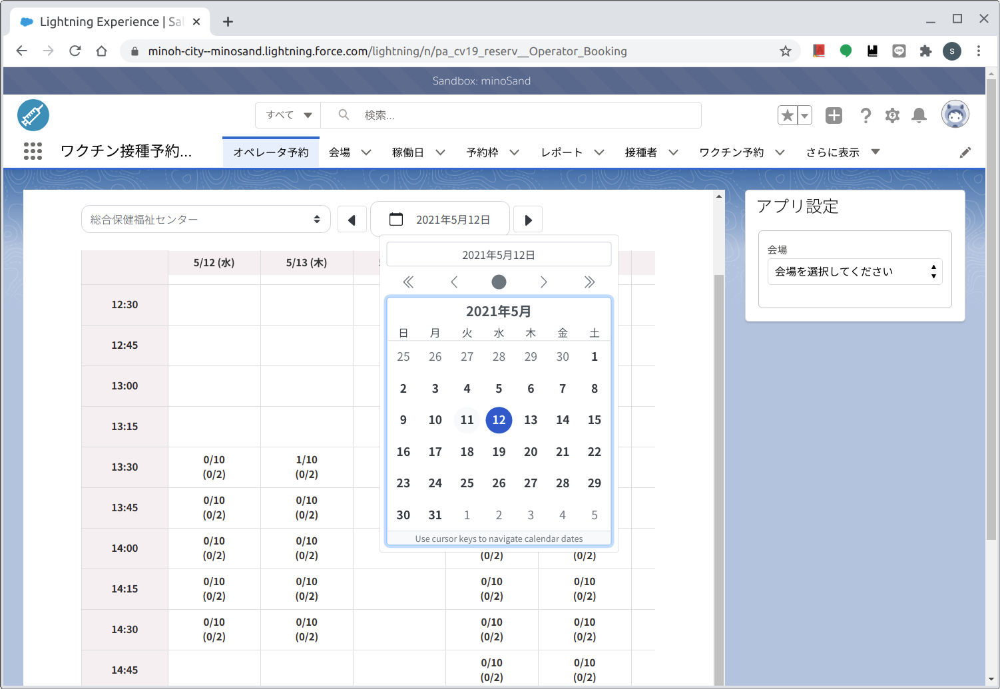
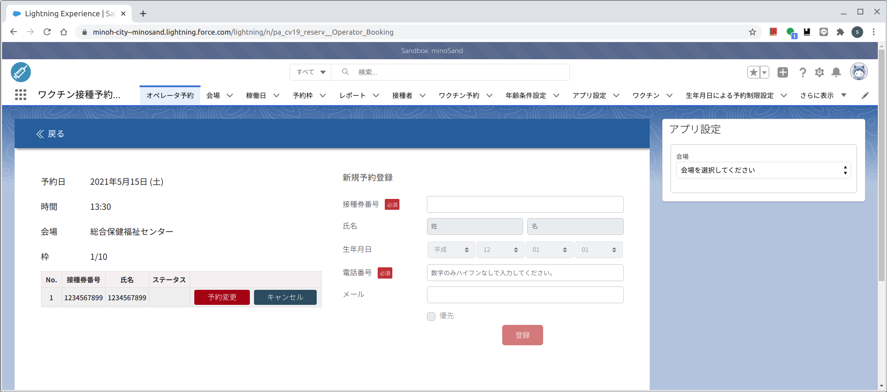
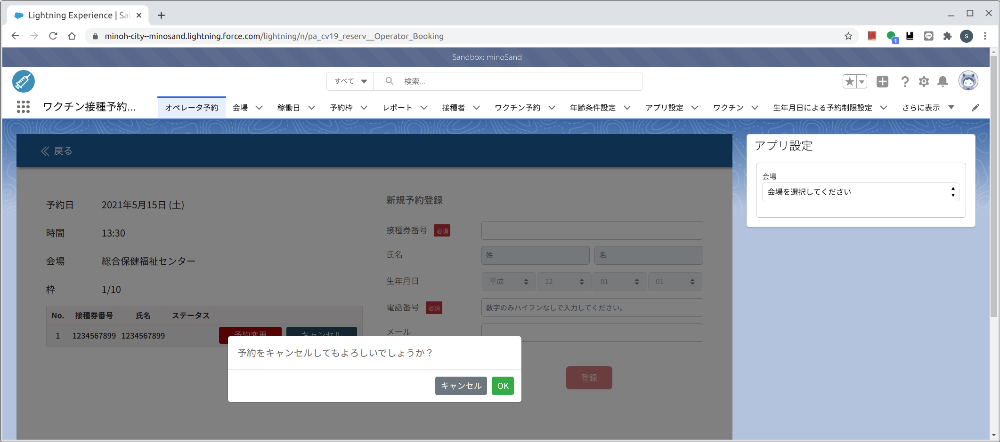
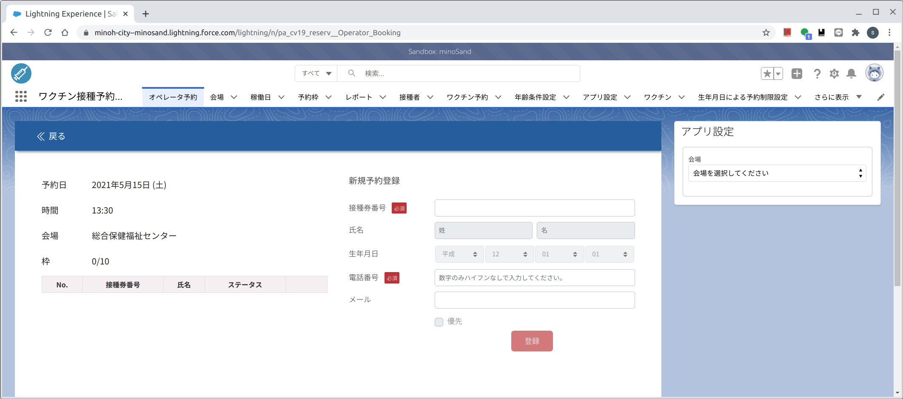

# コールセンター版　４予約キャンセル　[トップへ戻る](https://github.com/78tch/c19v)  
## [１ログイン](https://github.com/78tch/c19v/blob/main/Callcenter_ver/1Callcenter_login.md)→[２予約受付](https://github.com/78tch/c19v/blob/main/Callcenter_ver/2Callcenter_yoyaku.md)→[３予約変更](https://github.com/78tch/c19v/blob/main/Callcenter_ver/3Callcenter_henkou.md)→４予約キャンセル  
  

※コールセンター版  
変更・キャンセルしたい予約の「会場・日時」を選んだのち、該当する「接種券番号」を選択して、「変更」または「キャンセル」をクリックする。  
  

  手順 | 画面  
----|----  
 1.システムにログイン https://test.salesforce.com/ | 画面１    
 ID/PWは別途、本番はまた別のアドレス | 画面１  
 2.「ワクチン接種予約システム→オペレータ予約」を開く。 | 画面２  
 3.キャンセルしたい予約の「会場、日付」を選ぶ。 | 画面３※「接種券番号」から検索する方法は確認中。  
 4.キャンセルしたい「接種券番号」の横の「キャンセル」をクリックする。 | 画面４  
 5.「予約をキャンセルしてもよろしいでしょうか？」に「ＯＫ」をクリックする。 | 画面５  
 6.リストから「接種券番号」が消えていることを確認する。 | 画面６  

 

 画面 | 画面イメージ  
----|----
 画面１ |   
 画面２ |   
 画面３ |   
 画面４ |   
 画面５ |   
 画面６ |   
 
 デフォルト文言 | 差し替え案  
----|----
 画面１．ホーム |   
 画面２． |   
 画面３． |   
 画面４． |   
 画面５． |   
 画面６． |   
 画面７． |   

## [トップへ戻る](https://github.com/78tch/c19v)  
## [１予約受付](https://github.com/78tch/c19v/blob/main/Callcenter_ver/1Callcenter_yoyaku.md)→[２予約変更](https://github.com/78tch/c19v/blob/main/Callcenter_ver/2Callcenter_henkou.md)→[３予約キャンセル]  