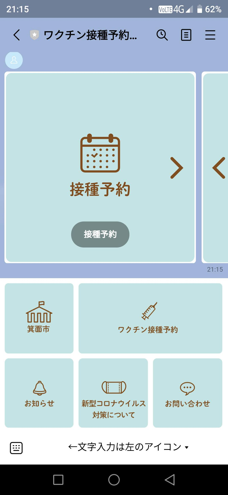
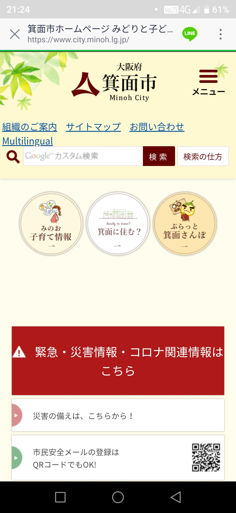
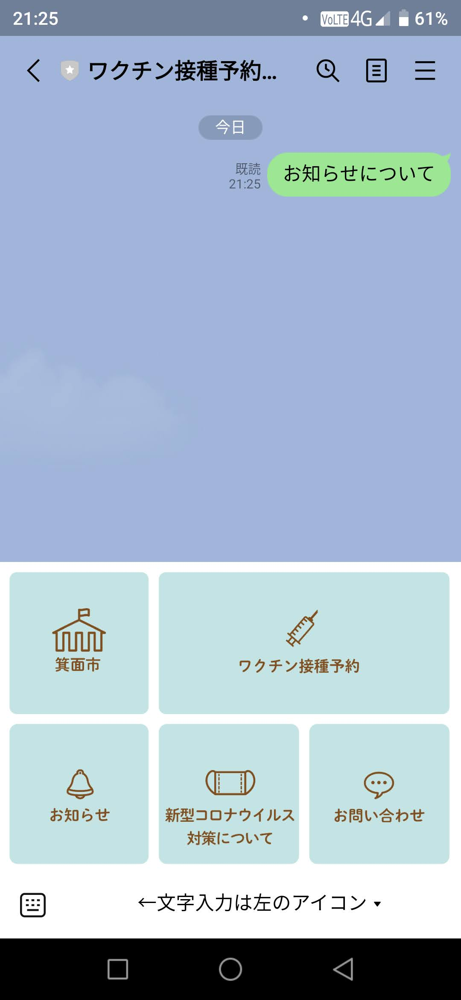
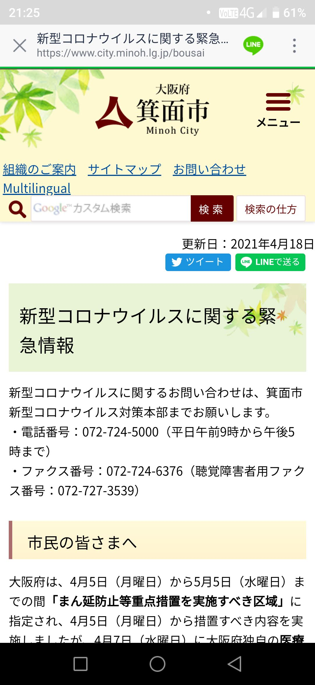
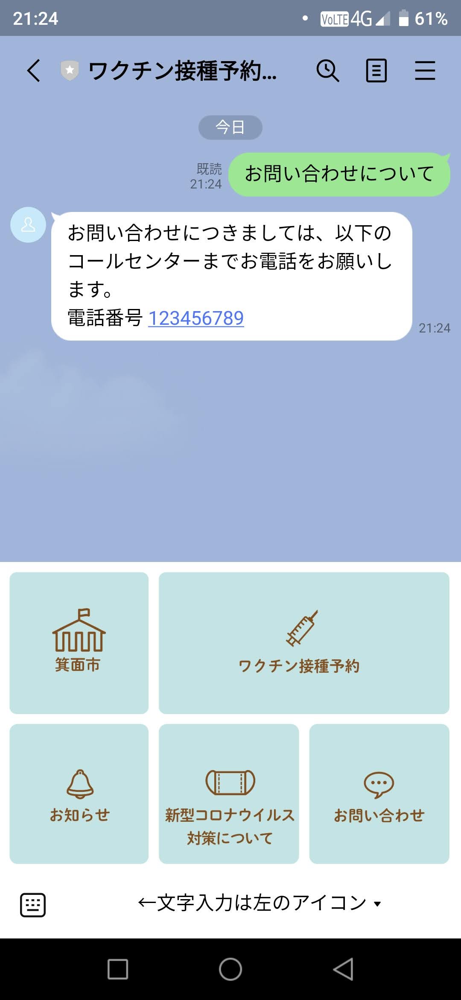

# LINE版　２リッチメニュー　[トップへ戻る](https://github.com/78tch/c19v)  
# [１友だち登録](https://github.com/78tch/c19v/blob/main/LINE_ver/1LINE_start.md)→２リッチメニュー →[３予約申込](https://github.com/78tch/c19v/blob/main/LINE_ver/3LINE_yoyaku.md)→[４予約変更](https://github.com/78tch/c19v/blob/main/LINE_ver/4LINE_henkou.md)→[５予約キャンセル](https://github.com/78tch/c19v/blob/main/LINE_ver/5LINE_cancel.md)  

※LINE版  
まず、「箕面市LINE公式アカウント」を友だち登録する。  
現時点ではテスト系のQRコードを使用する。

 手順 | 画面  
----|----  
 1.トーク画面の下半分が「リッチメニュー」で、LINE版のランチャーになっている。 | 画面１    
 2.（仮）左上「箕面市」をクリックすると市のホームページ。 | 画面２  
 3.右上「ワクチン接種予約」をクリックすると予約メニューが表示される。 | 画面３
 4.（未）左下「お知らせ」をクリックすると　○　が表示される。 | 画面４  
 5.（仮）中下「新型コロナウイルス対策について」をクリックすると　防災情報　が表示される。 | 画面５  
 6.右下「お問い合わせ」をクリックすると、コールセンターの電話番号が表示される。 | 画面６  
 

 画面 | 画面イメージ  
----|----
 画面１ |   
 画面２ |   
 画面３ |   
 画面４ |   
 画面５ |   
 画面６ |   

 デフォルト文言 | 差し替え案  
----|----
 画面１．ホーム |   
 画面２． |   
 画面３． |   
 画面４． |   

# [トップへ戻る](https://github.com/78tch/c19v)  
# [１友だち登録](https://github.com/78tch/c19v/blob/main/LINE_ver/1LINE_start.md)→２リッチメニュー →[３予約申込](https://github.com/78tch/c19v/blob/main/LINE_ver/3LINE_yoyaku.md)→[４予約変更](https://github.com/78tch/c19v/blob/main/LINE_ver/4LINE_henkou.md)→[５予約キャンセル](https://github.com/78tch/c19v/blob/main/LINE_ver/5LINE_cancel.md)  

  