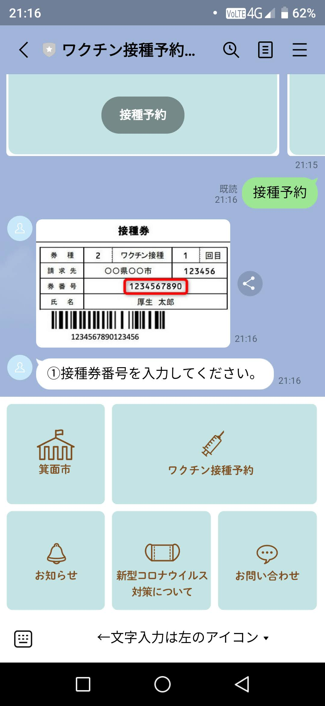
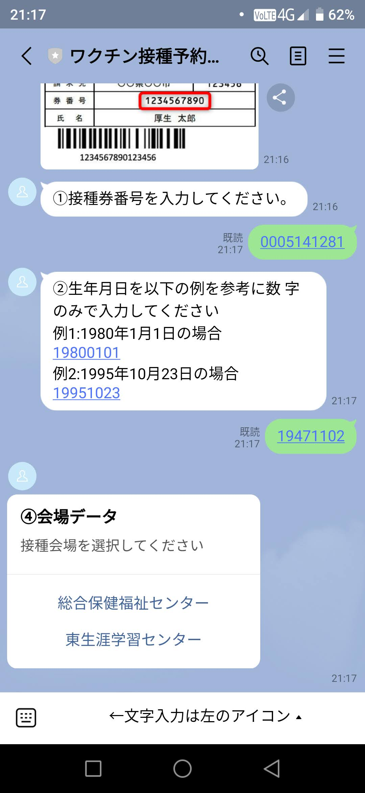
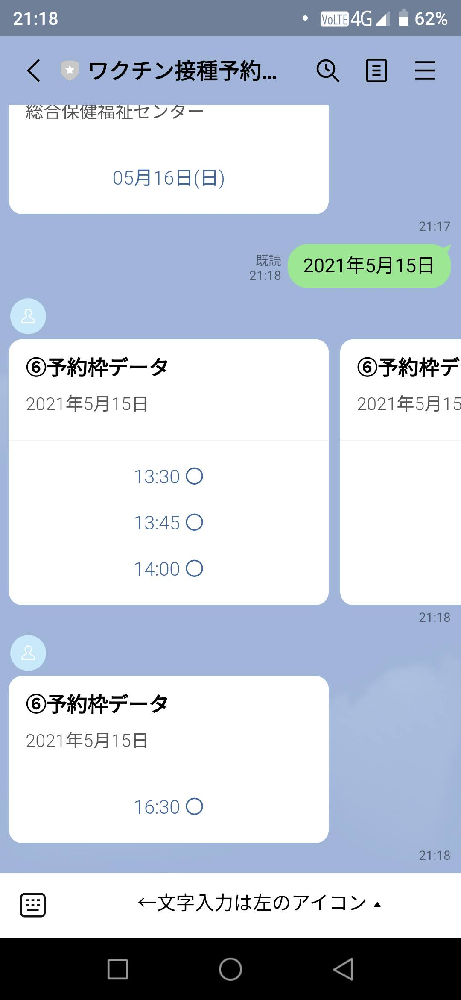
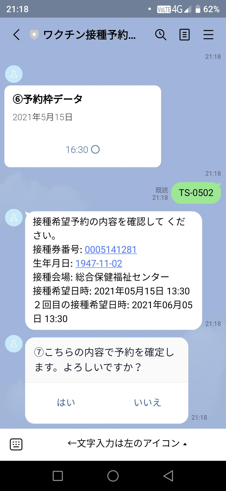
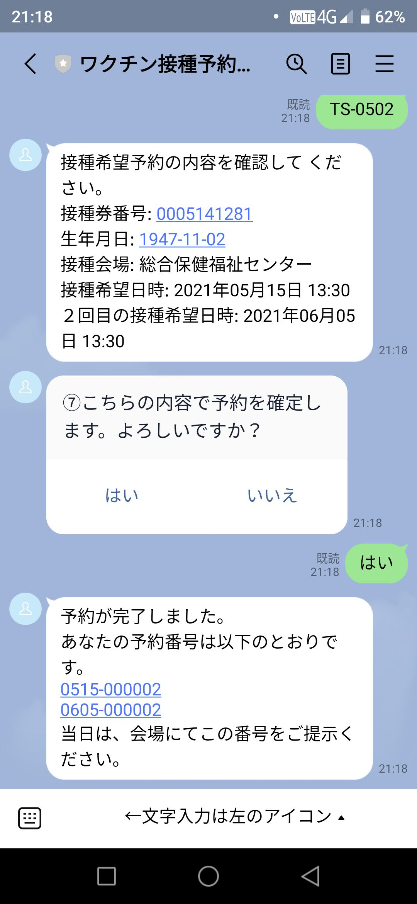

# LINE版　３予約申込　[トップへ戻る](https://github.com/78tch/c19v)  
## [１友だち登録](https://github.com/78tch/c19v/blob/main/LINE_ver/1LINE_start.md)→[２リッチメニュー](https://github.com/78tch/c19v/blob/main/LINE_ver/2LINE_richmenu.md) →３予約申込→[４予約変更](https://github.com/78tch/c19v/blob/main/LINE_ver/4LINE_henkou.md)→[５予約キャンセル](https://github.com/78tch/c19v/blob/main/LINE_ver/5LINE_cancel.md)  

※LINE版  
まず、「箕面市LINE公式アカウント」を友だち登録する。  
現時点ではテスト系のQRコードを使用する。

 手順 | 画面  
----|----  
 1.リッチメニューで「ワクチン接種予約」をタップする。 | 画面１    
 2.「接種予約」をタップする。 | 画面２  
 3.「接種券番号（前ゼロ省略不可の10桁、生年月日（区切りなしの8桁）」を入力。入力は画面左下隅のアイコンをタップ。 | 画面３  
 4.「会場、日にち」を選択する。 | 画面４  
 5.「予約枠」で時刻を選択する。 | 画面５  
 6.「予約番号」を確認する。 | 画面６  

 画面 | 画面イメージ  
----|----
 画面１ |   
 画面２ |   
 画面３ |   
 画面４ |   
 画面５ |   
 画面６ |   

 デフォルト文言 | 差し替え案  
----|----
 画面１．ホーム |   
 画面２． |   
 画面３． |   
 画面４． |   

## [トップへ戻る](https://github.com/78tch/c19v)  
## [１友だち登録](https://github.com/78tch/c19v/blob/main/LINE_ver/1LINE_start.md)→[２リッチメニュー](https://github.com/78tch/c19v/blob/main/LINE_ver/2LINE_richmenu.md) →３予約申込→[４予約変更](https://github.com/78tch/c19v/blob/main/LINE_ver/4LINE_henkou.md)→[５予約キャンセル](https://github.com/78tch/c19v/blob/main/LINE_ver/5LINE_cancel.md) 

  