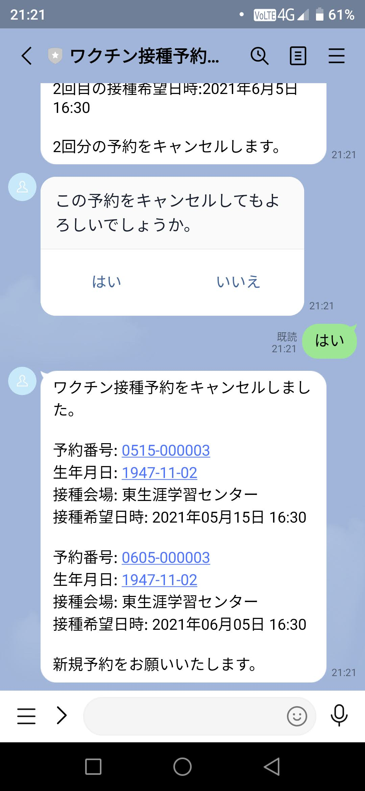

# LINE版　５予約キャンセル　[トップへ戻る](https://github.com/78tch/c19v)  
# [１友だち登録](https://github.com/78tch/c19v/blob/main/LINE_ver/1LINE_start.md)→[２リッチメニュー](https://github.com/78tch/c19v/blob/main/LINE_ver/2LINE_richmenu.md) →[３予約申込](https://github.com/78tch/c19v/blob/main/LINE_ver/3LINE_yoyaku.md)→[４予約変更](https://github.com/78tch/c19v/blob/main/LINE_ver/4LINE_henkou.md)→５予約キャンセル]

※LINE版  
まず、「箕面市LINE公式アカウント」を友だち登録する。  
現時点ではテスト系のQRコードを使用する。

 手順 | 画面  
----|----  
 1.リッチメニューで「ワクチン接種予約」をタップし、左スワイプして「キャンセル」をタップする。 | 画面１  
 2.「接種券番号（前ゼロ省略不可の10桁、生年月日（区切りなしの8桁）」を入力。入力は画面左下隅のアイコンをタップ。 | 画面２  
 3.「予約キャンセル」をタップする。 | 画面３  
 4.キャンセルが完了すると、改めて「予約番号」が発行されるので確認する。 | 画面４※「新規予約をお願いします」がイマイチ、「空きがあれば再予約は可能です」ぐらいか。  
 5.「接種券番号」入力不正 | 画面５  
 6.「誕生日」入力不正 | 画面６  
 7.予約がないのに「予約変更、キャンセル」 | 画面７  
 8.「予約変更」で２回目のボタンをタップ | 画面８  
 9.「キャンセル」で２回目のボタンをタップ | 画面９  

 

 画面 | 画面イメージ  
----|----
 画面１ |   
 画面２ |   
 画面３ |   
 画面４ |   
 画面５ |   
 画面６ |   
 画面７ |   
 画面８ |   
 画面９ |   

 デフォルト文言 | 差し替え案  
----|----
 画面１．ホーム |   
 画面２． |   
 画面３． |   
 画面４． |   

# [トップへ戻る](https://github.com/78tch/c19v)  
# [１友だち登録](https://github.com/78tch/c19v/blob/main/LINE_ver/1LINE_start.md)→[２リッチメニュー](https://github.com/78tch/c19v/blob/main/LINE_ver/2LINE_richmenu.md) →[３予約申込](https://github.com/78tch/c19v/blob/main/LINE_ver/3LINE_yoyaku.md)→[４予約変更](https://github.com/78tch/c19v/blob/main/LINE_ver/4LINE_henkou.md)→５予約キャンセル]
  