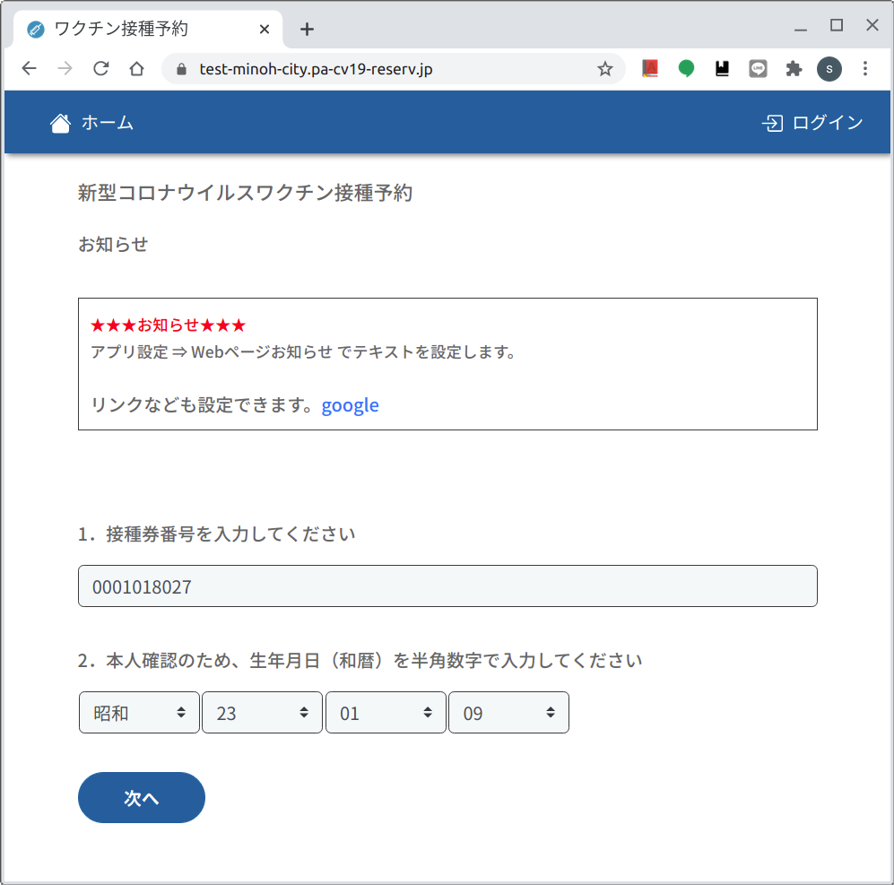
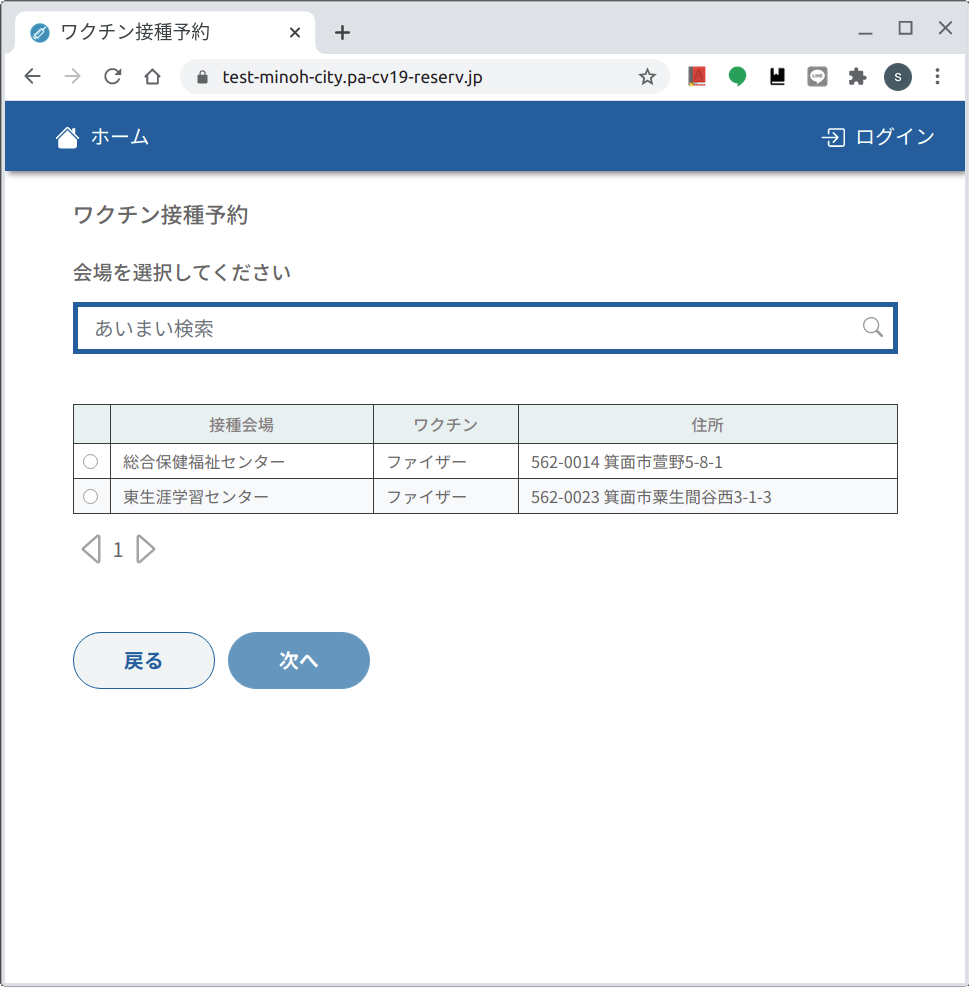
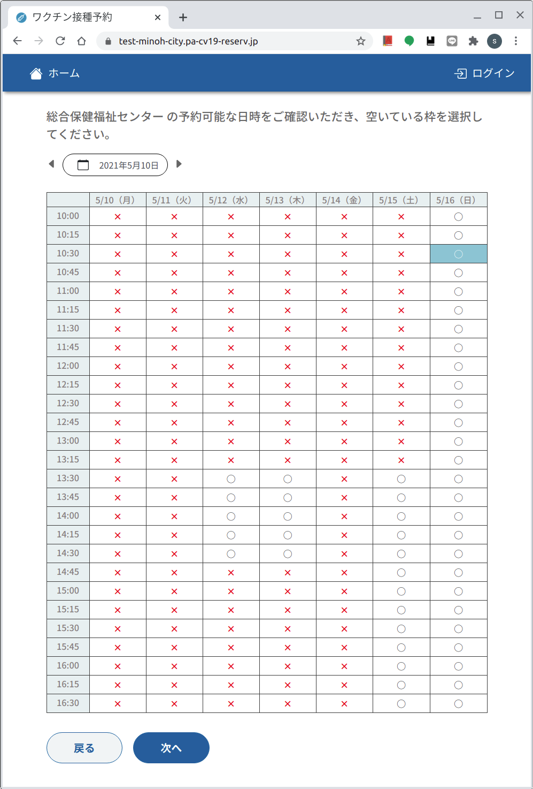
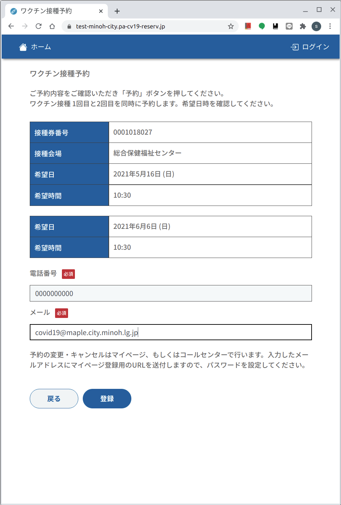
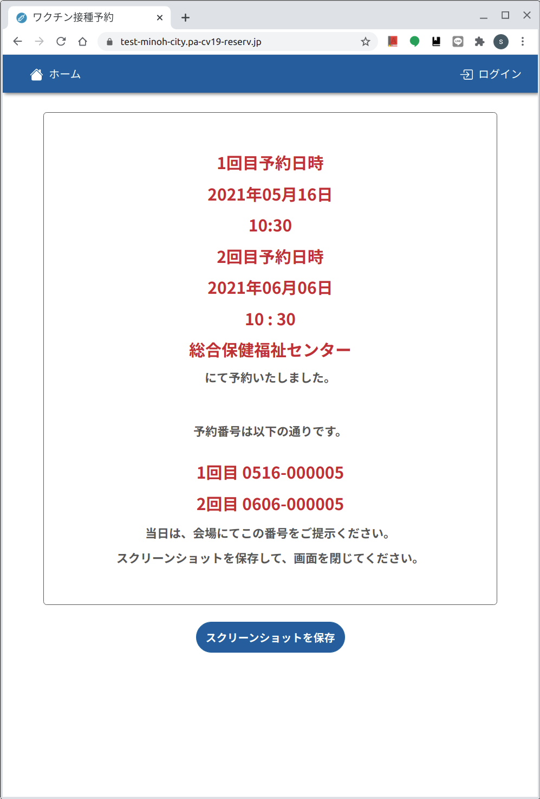
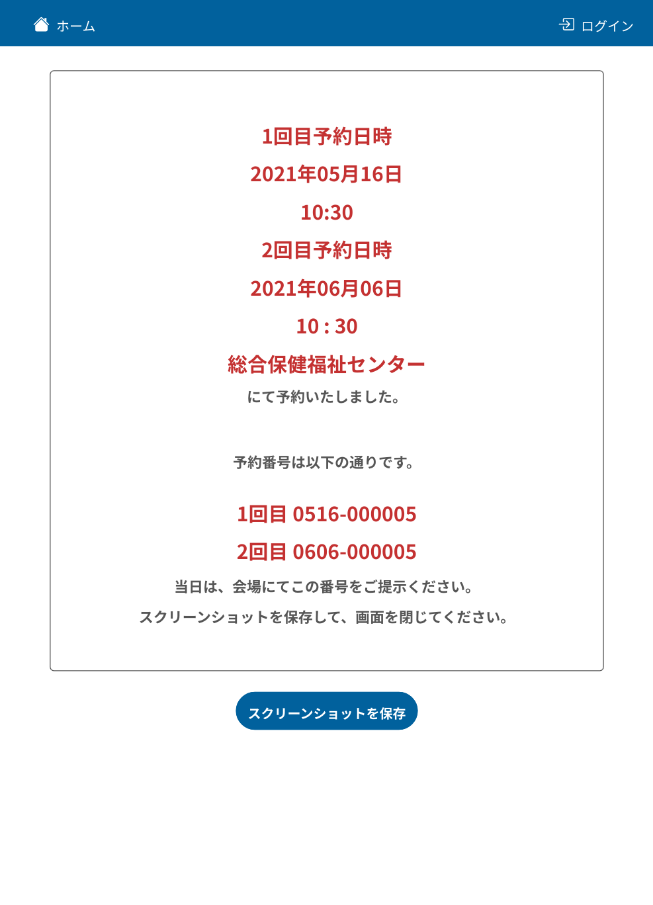

# Web版　１予約申込　[トップに戻る](https://github.com/78tch/c19v)  
## １予約申込→[２マイページ](https://github.com/78tch/c19v/blob/main/Web_ver/2Web_mypage.md)→[３予約変更](https://github.com/78tch/c19v/blob/main/Web_ver/3Web_henkou.md)→[４予約キャンセル](https://github.com/78tch/c19v/blob/main/Web_ver/4Web_cancel.md)  

※７５歳以下の案内、受付制限  
※予約済みの人は初期画面からは入れない。「ログイン」から「マイページ」にログインする必要あり。
※「マイページ」の「ユーザー名」は接種券番号。（メアドではない。）「パスワード」は自分で設定したもの。  
※Web版で予約した人の予約情報確認、変更・キャンセルは、「マイページ」からする。  
※通知メールいく。  
※第１回接種予約受付では、今年度７５歳以上（昭和２２年４月１日生まれ以上）のみ受付します。  
　第２回接種予約（５月○日）では、今年度６５歳以上（昭和３２年４月１日生まれ以上）を受付します。

 手順 | 画面  
----|----
 1.Web版を開く | https://test-minoh.pa-cv19-reserv.jp/  
 （接続できない場合はこちら） | https://test-minoh-city.pa-cv19-reserv.jp/  
 2.接種券番号を入力する | 画面１  
 3.生年月日を入力する | 画面１  
 4.会場を選ぶ | 画面２  
 5.日付を選ぶ | 画面３  
 6.「○」を選ぶ | 画面３ 
 7.電話番号を入力 | 画面４ 
 8.メールアドレスを入力 | 画面４
 9.スクリーンショットを保存 | 画面５  
 10.保存された画像 | 画面６  

 画面 | 画面イメージ  
----|----
 画面１ |   
 画面２ |   
 画面３ |   
 画面４ |   
 画面５ |   
 画面６ |   

 デフォルト文言 | 差し替え案  
----|----
 画面１．ホーム |   
 画面１．新型コロナウイルスワクチン接種予約 |  
 画面１．お知らせ | 画面１  
 画面１．「１．接種券番号を入力してください」 | ※接種券の画像を入れたい  
 画面１．「２．本人確認のため、生年月日（和暦）を半角数字で入力してください」  | ※年号の初期値を「昭和」にしたい  
 画面１．「次へ」 | ※「お知らせ」と「入力欄」が紛らわしい  
 画面１．接種券番号入力時：「チケット番号は10桁の数字でなければなりません」 | ※「接種券番号は前ゼロも含め10桁で入力してください。」  
 画面１．照合不可時：「入力内容を再度ご確認ください。」 | ※  
 画面２．ワクチン接種予約 | ※  
 画面２．会場を選択してください | ※どこを選択するのかわかりにくい、  
 画面２．あいまい検索 | ※会場名しか不可  
 画面２．、接種会場、ワクチン、住所 | ※「↓会場を選択してください」  
 画面２．戻る・次へ | ※戻ると「ログイン画面」になる？  
 画面３．「●の予約可能な日時をご確認いただき、空いている枠を選択してください。」 | ※日付選択をもっと目立つように  
 あ | 「１．希望の日時に切り替えて、予約枠に「○」があるかご確認ください。  
 改行 | ※もともと枠がないのと、枠がふさがったのは区別される？ 
 あ | 「２．空いている枠を選択し、欄外下の「次へ」を押してください。２回目接種の予約も併せてお取りします。」  
 画面４．ワクチン接種予約 | ※  
 画面４．ご予約内容をご確認いただき「予約」ボタンを押してください。ワクチン接種 1回目と2回目を同時に予約します。希望日時を確認してください。 | ※  
 画面４．接種券番号、接種会場、希望日、希望時間 | ※１回目接種  
 画面４．希望日、希望時間 | ※２回め接種  
 画面４．電話番号「数字のみハイフンなしで入力してください」 | ※「ハイフンなし１０桁または１１桁」  
 画面４．電話番号入力時：「電話番号のフォーマットが正しくありません」 | ※  「電話番号はハイフンなしの１０桁または１１桁で入力してください」
 画面４．メール | ※  
 画面４．メールアドレス入力時：「メールは有効なメールアドレスではありません」 | ※「受付完了時と予約の前日にメールを送信します」  
 画面４．予約の変更・キャンセルはマイページ、もしくはコールセンターで行います。入力したメールアドレスにマイページ登録用のURLを送付しますので、パスワードを設定してください。 | ※  
 画面４．戻る・登録 | ※  
 画面５．にて予約しました | ※  
 画面５．当日は、会場にてこの番号をご提示ください。スクリーンショットを保存して、画面を閉じてください。 | ※  
 画面５．スクリーンショットを保存 | 2021年05月16日_ワクチン予約.png  

## [トップに戻る](https://github.com/78tch/c19v)  
## １予約申込→[２マイページ](https://github.com/78tch/c19v/blob/main/Web_ver/2Web_mypage.md)→[３予約変更](https://github.com/78tch/c19v/blob/main/Web_ver/3Web_henkou.md)→[４予約キャンセル](https://github.com/78tch/c19v/blob/main/Web_ver/4Web_cancel.md)  
