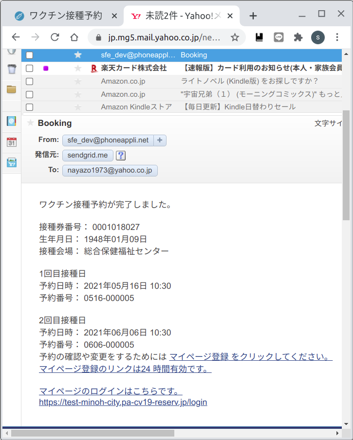
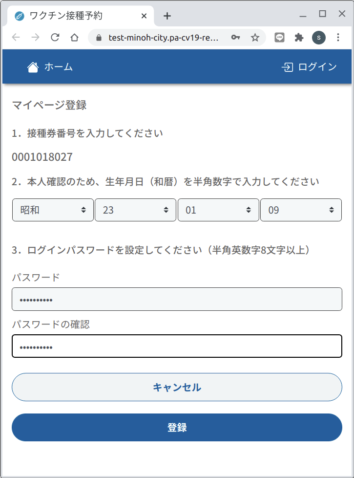
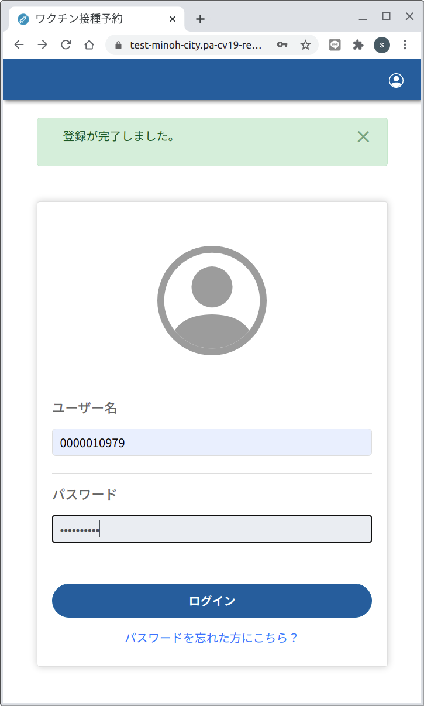
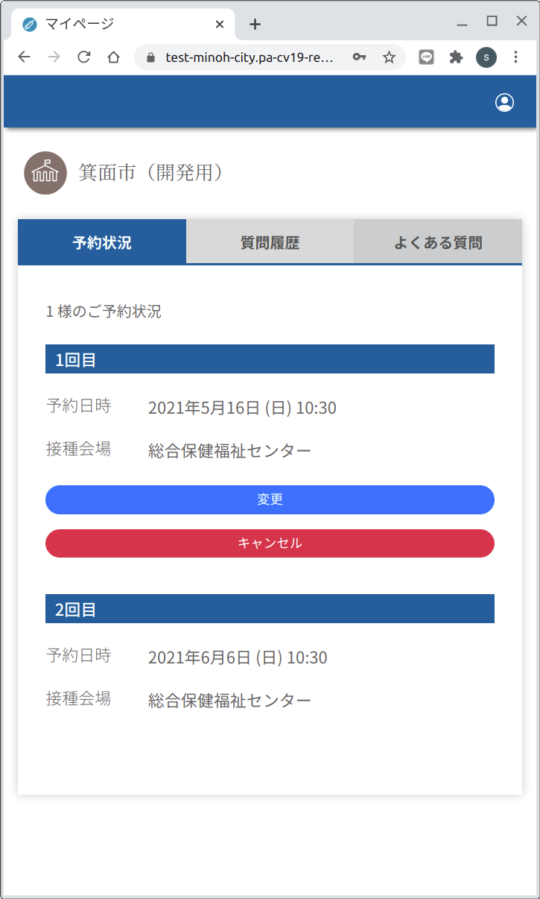
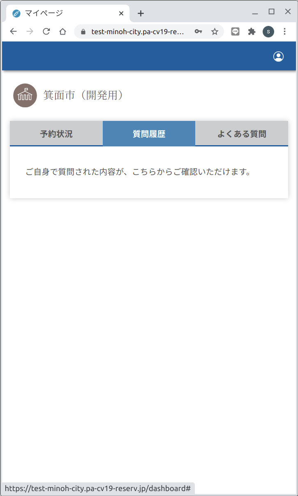
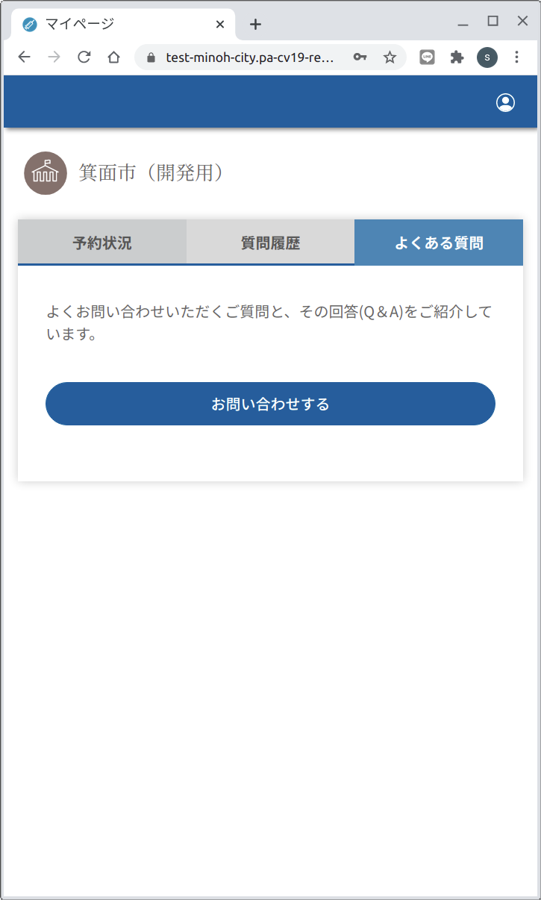

# Web版　２マイページ　[トップへ戻る](https://github.com/78tch/c19v)  
## [１予約申込](https://github.com/78tch/c19v/blob/main/Web_ver/1Web_yoyaku.md)→２マイページ→[３予約変更](https://github.com/78tch/c19v/blob/main/Web_ver/3Web_henkou.md)→[４予約キャンセル](https://github.com/78tch/c19v/blob/main/Web_ver/4Web_cancel.md)  

※Web版では、予約済のひとが再度「接種券番号・生年月日」を入れた場合、入力間違いと同じエラーメッセージが出て、先には進まない。  
※予約申込が成功すると、予約内容の通知メールがくる。そのメールのなかに「マイページ」の登録リンクもある。  
　「申し込んだ予約の確認や、変更・キャンセル」は、この「マイページ」に「ログイン」ボタンからログインしてする。  
※「ログイン」のユーザー名は「接種券番号」  
※「マイページ」を登録してもしなくても、コールセンター画面からは確認・変更・キャンセルができる。  
  

 手順 | 画面  
----|----  
 1.予約受付通知メールの「マイページ」登録リンクを開く | 画面１※リンク文字以外にもアンダーバーあり  
 2.接種券番号は表示されている | 画面２※「入力してください」になっている  
 3.生年月日を入力する | 画面２  
 4.パスワードを２回入力する（自分で決める） | 画面２  
 5.ログイン画面になるので、「ユーザー名」に接種券番号と、パスワードを入力する | 画面３  
 6.予約内容を確認する | 画面４※「変更、キャンセル」の位置は「２回目」の下？  
 6 | ※「姓」様のご予約状況、と出るので、「姓」には接種券番号を再掲  
 6.2質問履歴 | 画面４_2※不要  
 6.3よくある質問 | 画面４_3※不要  
 

 画面 | 画面イメージ  
----|----
 画面１ |   
 画面２ |   
 画面３ |   
 画面４ |   
 画面４_2 |   
 画面４_3 |   
 
 デフォルト文言 | 差し替え案  
----|----
 画面１．ホーム |   
 画面２． |   
 画面３． |   
 画面４． |   
 画面４_2． |   
 画面４_3． |   

 

## [トップへ戻る](https://github.com/78tch/c19v)  
## [１予約申込](https://github.com/78tch/c19v/blob/main/Web_ver/1Web_yoyaku.md)→２マイページ→[３予約変更](https://github.com/78tch/c19v/blob/main/Web_ver/3Web_henkou.md)→[４予約キャンセル](https://github.com/78tch/c19v/blob/main/Web_ver/4Web_cancel.md)  