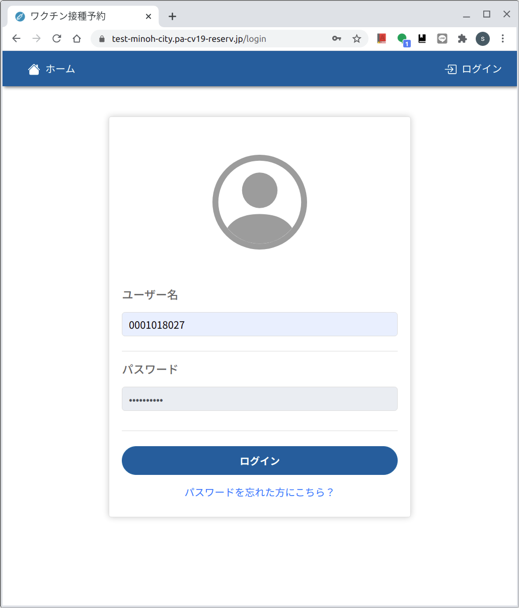

# Web版　３．予約変更　[戻る](https://github.com/78tch/c19v)　[次へ](https://github.com/78tch/c19v/blob/main/Web_ver/4Web_cancel.md)
# [１予約申込](https://github.com/78tch/c19v/blob/main/Web_ver/1Web_yoyaku.md)→[２マイページ](https://github.com/78tch/c19v/blob/main/Web_ver/2Web_mypage.md)→３予約変更→[４予約キャンセル](https://github.com/78tch/c19v/blob/main/Web_ver/4Web_cancel.md)  

※Web版では、予約済のひとが再度「接種券番号・生年月日」を入れた場合、入力間違いと同じエラーメッセージが出て、先には進まない。  
※予約申込が成功すると、予約内容の通知メールがくる。そのメールのなかに「マイページ」の登録リンクもある。  
　「申し込んだ予約の確認や、変更・キャンセル」は、この「マイページ」に「ログイン」ボタンからログインしてする。  
※「ログイン」のユーザー名は「接種券番号」  
※「マイページ」を登録してもしなくても、コールセンター画面からは確認・変更・キャンセルができる。  
  

 手順 | 画面  
----|----
 1.「マイページ」へのログインは、Web版の「ログイン」リンクボタンを開く | 画面１
 2.「ユーザー名」接種券番号と、パスワードを入力する | 画面２  
 3.「変更」ボタンをクリック | 画面３  
 4.変更を希望する会場を選択する | 画面４  
 5.変更を希望する予約枠を選択する | 画面５  ※変更で同じ枠を選ぶと「タイムスロットは以前と同じです」
 6.変更内容を確認し、「登録」をクリック | 画面６  
 7.予約変更確定画面（スクショ撮り、「マイページ」へ戻る） | 画面７  
 8.「マイページ」でも予約が変更されていることを確認 | 画面８  
 

 画面 | 画面イメージ  
----|----
 画面１ |   
 画面２ |   
 画面３ |   
 画面４ |   
 画面５ |   
 画面６ |   
 画面７ |   
 
 デフォルト文言 | 差し替え案  
----|----
 画面１．ホーム |   
 画面２． |   
 画面３． |   
 画面４． |   
 画面５． |   
 画面６． |   
 画面７． |   

[戻る](https://github.com/78tch/c19v)　[次へ](https://github.com/78tch/c19v/blob/main/Web_ver/4Web_cancel.md)
# [１予約申込](https://github.com/78tch/c19v/blob/main/Web_ver/1Web_yoyaku.md)→[２マイページ](https://github.com/78tch/c19v/blob/main/Web_ver/2Web_mypage.md)→３予約変更→[４予約キャンセル](https://github.com/78tch/c19v/blob/main/Web_ver/4Web_cancel.md)  