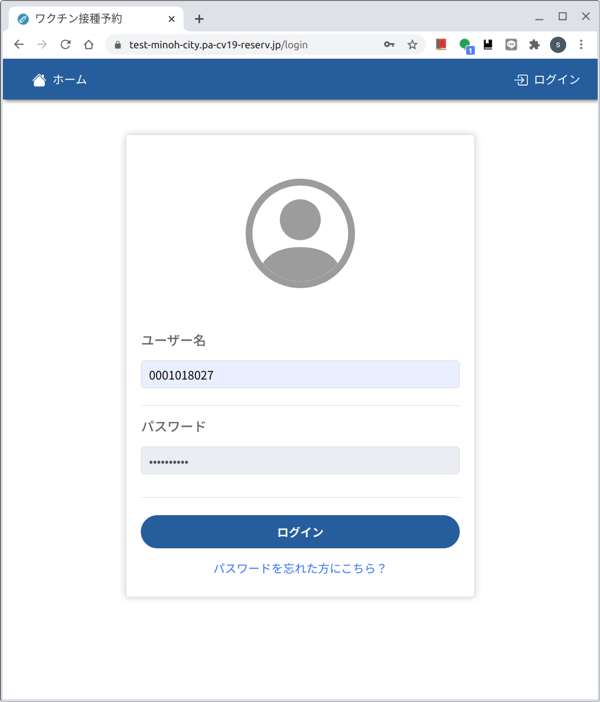
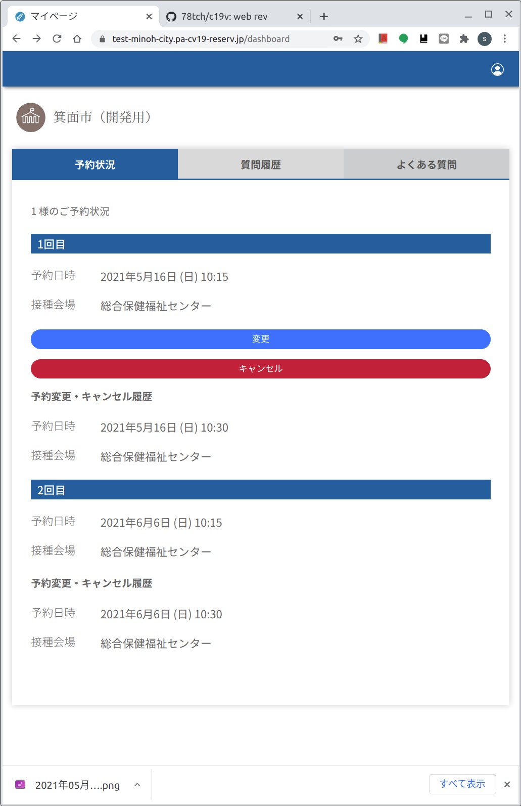
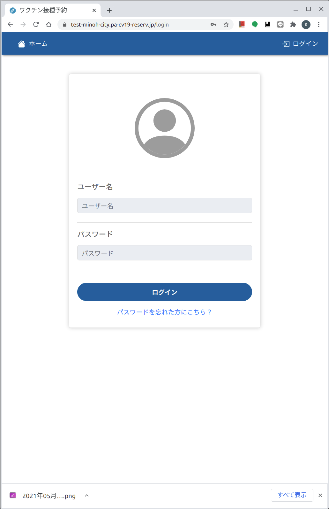
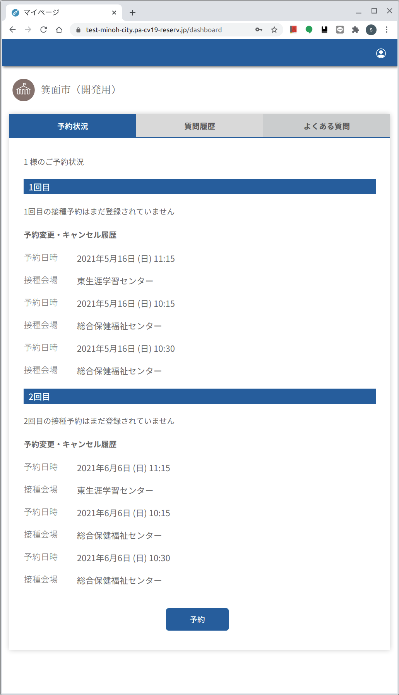
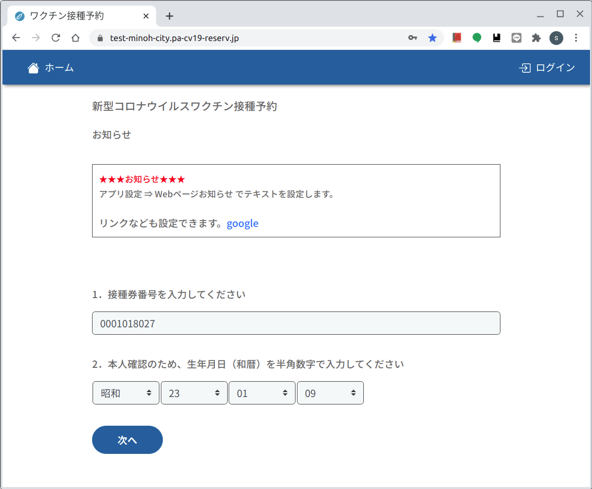

# Web版　４予約キャンセル　[トップへ戻る](https://github.com/78tch/c19v)  
## [１予約申込](https://github.com/78tch/c19v/blob/main/Web_ver/1Web_yoyaku.md)→[２マイページ](https://github.com/78tch/c19v/blob/main/Web_ver/2Web_mypage.md)→[３予約変更](https://github.com/78tch/c19v/blob/main/Web_ver/3Web_henkou.md)→４予約キャンセル  

※Web版では、予約済のひとが再度「接種券番号・生年月日」を入れた場合、入力間違いと同じエラーメッセージが出て、先には進まない。  
※予約申込が成功すると、予約内容の通知メールがくる。そのメールのなかに「マイページ」の登録リンクもある。  
　「申し込んだ予約の確認や、変更・キャンセル」は、この「マイページ」に「ログイン」ボタンからログインしてする。  
※「ログイン」のユーザー名は「接種券番号」  
※「マイページ」を登録してもしなくても、コールセンター画面からは確認・変更・キャンセルができる。  
  

 手順 | 画面  
----|----
 1.「マイページ」へのログインは、Web版の「ログイン」リンクボタンを開く | 画面１
 2.「ユーザー名」接種券番号と、パスワードを入力する | 画面２  
 3.「キャンセル」ボタンをクリックする | 画面３※「予約をキャンセルする」ぐらいのほうがよい  
 4.「予約をキャンセルする」をクリックする | 画面４  
 5.マイページに戻る | 画面５  
 6.改めてログインすると、予約がなくなっていて、履歴が残っている※リロードが必要 | 画面６  
 7.マイページの「予約」でも、「１予約申込」の方法でも、どちらの方法でも、改めて予約することは可能。 | 画面６、画面７  
 

 画面 | 画面イメージ  
----|----
 画面１ |   
 画面２ |   
 画面３ |   
 画面４ |   
 画面５ |   
 画面６ |   
 画面７ |   
 
 デフォルト文言 | 差し替え案  
----|----
 画面１．ホーム |   
 画面２． |   
 画面３． |   
 画面４． |   
 画面５． |   
 画面６． |   
 画面７． |   

## [トップへ戻る](https://github.com/78tch/c19v)  
## [１予約申込](https://github.com/78tch/c19v/blob/main/Web_ver/1Web_yoyaku.md)→[２マイページ](https://github.com/78tch/c19v/blob/main/Web_ver/2Web_mypage.md)→[３予約変更](https://github.com/78tch/c19v/blob/main/Web_ver/3Web_henkou.md)→４予約キャンセル  